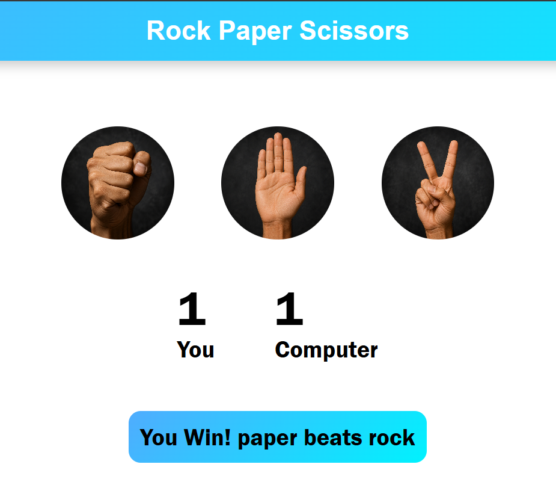
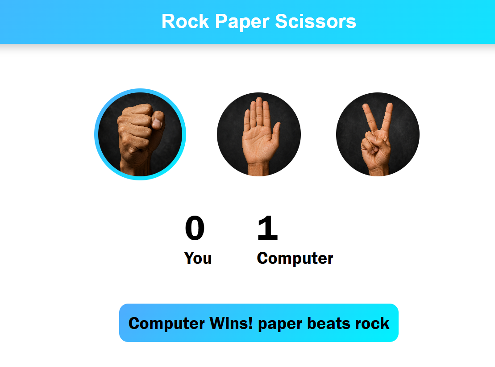
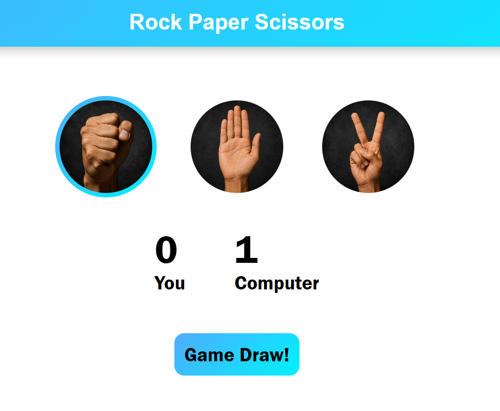

# ✊✋✌️ Rock Paper Scissors Game

A simple and interactive **Rock Paper Scissors** game built using **HTML, CSS, and JavaScript**. Play against the computer and see who reaches the highest score!

---

## 🚀 Features

* 🎮 Play Rock, Paper, or Scissors against the computer
* 🤖 Random computer moves
* 🏆 Real-time score tracking
* 🎨 Dynamic result messages with color changes
* 📱 Responsive and clean user interface
* ⚡ Built with vanilla JavaScript (no frameworks)

---

## 🛠️ Technologies Used

* HTML5
* CSS3
* JavaScript (ES6)

---

## 📂 Project Structure

```text
Rock-Paper-Scissors/
│
├── index.html
├── style.css
├── script.js
├── README.md
│
└── images/
    ├── rock.png
    ├── paper.png
    └── scissor.png
```

---

## 🎮 How to Play

1. Open `index.html` in your web browser.
2. Click on **Rock**, **Paper**, or **Scissors**.
3. The computer will randomly select its move.
4. The winner of the round is displayed instantly.
5. Scores are updated automatically.

### Game Rules

* 🪨 Rock beats Scissors
* ✂️ Scissors beats Paper
* 📄 Paper beats Rock
* Same choice = Draw

---

## 📸 Screenshot




```

---

## ▶️ Getting Started

Clone the repository:

```bash
git clone https://github.com/your-username/rock-paper-scissors.git
```

Go to the project folder:

```bash
cd rock-paper-scissors
```

Open `index.html` in your browser and start playing.

---

## 🌟 Future Improvements

* 🔊 Sound effects
* 🎞️ Win/Loss animations
* 🌙 Dark mode
* 📊 Match history
* 🏅 Best-of-5 or Best-of-10 mode
* 👥 Multiplayer mode

---

## 🤝 Contributing

Contributions are welcome!

1. Fork the repository.
2. Create a new branch.
3. Make your changes.
4. Commit your changes.
5. Push to your fork.
6. Open a Pull Request.

---

## 📄 License

This project is open source and available under the **MIT License**.

---

## 👨‍💻 Author

**Kunal Sharma**

If you enjoyed this project, consider giving it a ⭐ on GitHub!
